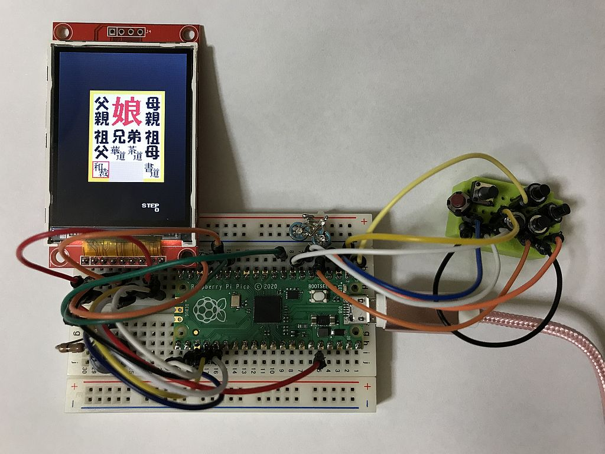
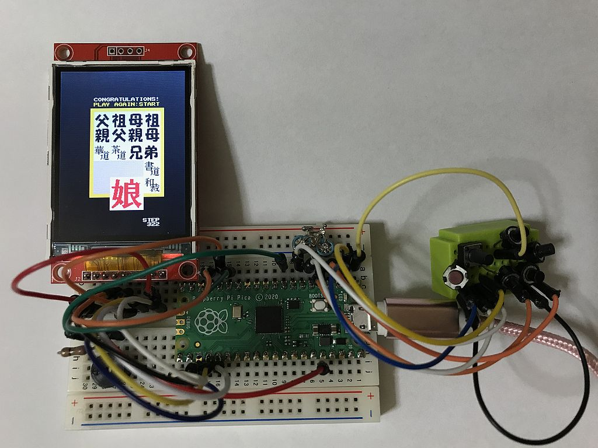
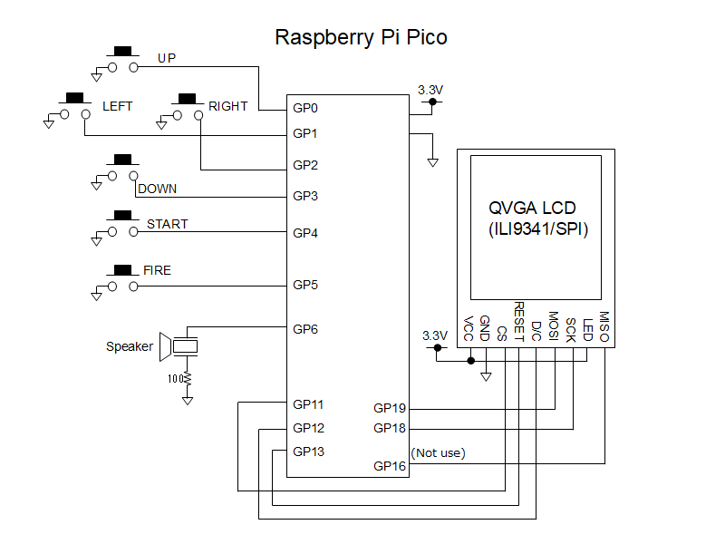

# 箱入り娘パズル for Raspberry Pi Pico
ラズベリーPi PicoにQVGAの液晶を接続して動作する「箱入り娘」という伝統的なパズルゲームです。  
とてもシンプルな回路なので、簡単に製作することができます。  
液晶は240x320ドット、コントローラにILI9341を搭載したSPI接続のものに対応しています。  
  
## 実行方法
ラズベリーPi PicoのBOOTSELボタンを押しながらPCのUSBポートに接続し、バイナリーファイル hakomusupico.uf2 をラズベリーPi Picoにコピーしてください。  
  
## 遊び方
方向ボタンで動かしたい駒を選択し、FIREボタンを押しながら方向ボタンを押すことでその方向に駒が動きます。  
「娘」と書かれた駒をうまく下の出口から脱出させてあげてください。  
  
## ソースプログラムのビルド方法
ソースプログラムのビルドにはRP2040に対応したコンパイラの他、CMake、pico-sdkが必要です。  
SDKが使用できる環境設定をした上で、ダウンロードした拡張子が.c .h .txt .cmakeのファイルを同じフォルダに入れてビルドしてください。  
  
  
  